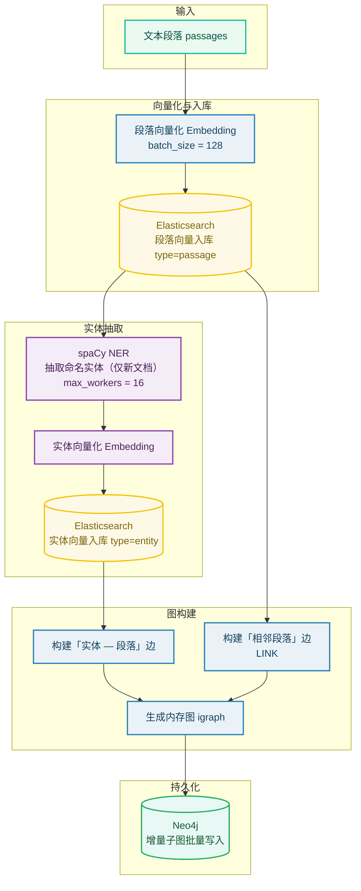
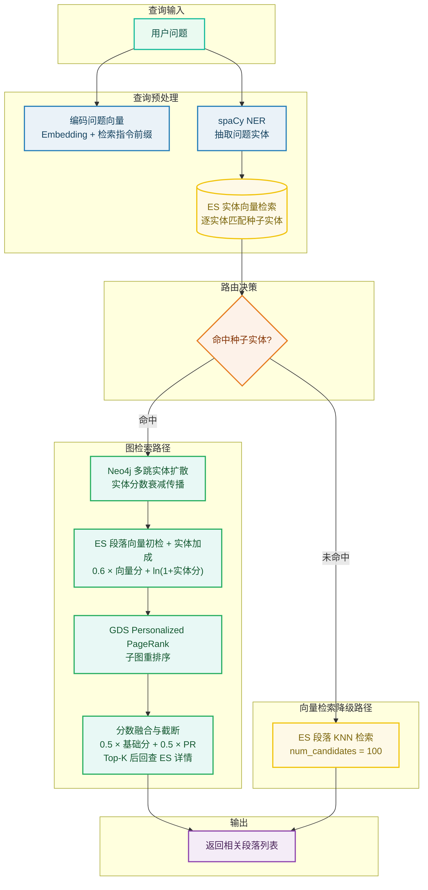

# SimpleRAG

SimpleRAG 是一个简洁、工程化的图增强检索（GraphRAG，Graph-enhanced Retrieval-Augmented Generation）框架。它在 LinearRAG 的基础上，将图建模收敛为「段落—词」结构，并把存储层替换为成熟的工程化组件——Elasticsearch 向量数据库与 Neo4j 图数据库，从而在保留图检索优势的同时，提升可维护性与高并发处理能力。

## 特性

- 段落—词图建模：仅使用段落与词两类节点构建检索图，图结构简洁。
- 工程化存储：向量检索基于 Elasticsearch，图存储与遍历基于 Neo4j。
- 图检索 + 向量检索降级：优先走图检索，未命中实体时自动降级为纯向量检索。
- 并发与增量索引：支持多 worker 并行处理与按知识库增量入库。
- REST API：基于 FastAPI 提供索引、检索、删除与健康检查接口。


## 技术栈

- Python ≥ 3.12
- FastAPI / Uvicorn
- spaCy（命名实体识别）
- Elasticsearch（向量检索）
- Neo4j（图数据库）
- OpenAI 兼容的 Embedding 服务（以及可选的 LLM 服务）

## 架构

### 索引流程



### 检索流程



## 目录结构

```text
.
├── main.py                 # FastAPI 服务入口
├── run_api.py              # 本地示例/调试脚本
├── requirements.txt        # Python 依赖
├── pyproject.toml          # 项目元数据
├── Dockerfile              # 容器构建文件
└── src/
    ├── config.py           # 配置数据类 LinearRAGConfig
    ├── LinearRAG.py        # 核心索引与检索逻辑
    ├── embedding.py        # OpenAI 兼容 Embedding 客户端
    ├── ner.py              # spaCy 命名实体识别
    ├── es.py               # Elasticsearch 封装
    ├── utils.py            # 日志与工具函数
    └── graphs_utils/
        ├── base.py         # 图数据库抽象基类
        └── neo4j_db.py     # Neo4j 实现
```

## 快速开始

### 环境要求

- Python ≥ 3.12
- Elasticsearch 8.x（默认 `http://localhost:9200`）
- Neo4j（默认 `bolt://localhost:7687`）
- 一个 OpenAI 兼容的 Embedding 服务（如需生成答案，另需 LLM 服务）

### 1. 安装依赖

```bash
pip install -r requirements.txt
```

### 2. 下载 spaCy 模型

中文：

```bash
python -m spacy download zh_core_web_md
```

英文：

```bash
python -m spacy download en_core_web_trf
```

### 3. 配置连接信息

服务端连接参数（Elasticsearch、Neo4j、Embedding、LLM）目前定义在 `main.py` 与 `run_api.py` 中，请按实际环境修改。推荐通过环境变量注入，示例：

```bash
export ES_URL="http://localhost:9200"
export ES_USER="elastic"
export ES_PASSWORD="${ES_PASSWORD}"
export NEO4J_URI="bolt://localhost:7687"
export NEO4J_USER="neo4j"
export NEO4J_PASSWORD="${NEO4J_PASSWORD}"
export NEO4J_DATABASE="neo4j"
export OPENAI_API_KEY="${OPENAI_API_KEY}"
export OPENAI_BASE_URL="${OPENAI_BASE_URL}"
export EMBEDDING_API_URL="${EMBEDDING_API_URL}"
export EMBEDDING_MODEL_NAME="qwen3-embedding"
export SPACY_MODEL="zh_core_web_md"
export MAX_WORKERS="16"
```

> 说明：本文使用 `${...}` 占位符表示需由你填写的值，请勿提交真实密码。当前示例中 `main.py` 与 `run_api.py` 仍为硬编码默认值，若需完全参数化请另行改造代码。

### 4. 启动服务

```bash
python main.py
```

服务默认监听 `0.0.0.0:12124`，健康检查：

```bash
curl http://localhost:12124/health
```

### 5. 本地示例

```bash
python run_api.py
```

`run_api.py` 内置一段示例文本，用于快速验证索引流程。

## 配置说明

### 连接与运行参数

| 参数                                   | 说明                         | 默认/示例                                      |
| ------------------------------------ | -------------------------- | ------------------------------------------ |
| `ES_URL`                             | Elasticsearch 地址           | `http://localhost:9200`                    |
| `ES_USER` / `ES_PASSWORD`            | Elasticsearch 账号           | `elastic` / `${ES_PASSWORD}`               |
| `NEO4J_URI`                          | Neo4j 连接地址                 | `bolt://localhost:7687`                    |
| `NEO4J_USER` / `NEO4J_PASSWORD`      | Neo4j 账号                   | `neo4j` / `${NEO4J_PASSWORD}`              |
| `NEO4J_DATABASE`                     | Neo4j 数据库名                 | `neo4j`                                    |
| `OPENAI_API_KEY` / `OPENAI_BASE_URL` | LLM 服务的 API Key 与 Base URL | `${OPENAI_API_KEY}` / `${OPENAI_BASE_URL}` |
| `LLM_MODEL_NAME`                     | LLM 模型名                    | `qwen3`                                    |
| `EMBEDDING_API_URL`                  | Embedding 服务地址             | `${EMBEDDING_API_URL}`                     |
| `EMBEDDING_MODEL_NAME`               | Embedding 模型名              | `qwen3-embedding`                          |
| `SPACY_MODEL`                        | spaCy NER 模型               | `zh_core_web_md`                           |
| `MAX_WORKERS`                        | 并行工作线程数                    | `16`                                       |

### LinearRAGConfig 参数

| 参数                         | 说明           | 默认值              |
| -------------------------- | ------------ | ---------------- |
| `chunk_token_size`         | 分块 token 数   | `1000`           |
| `chunk_overlap_token_size` | 分块重叠 token 数 | `100`            |
| `spacy_model`              | spaCy 模型     | `zh_core_web_md` |
| `working_dir`              | 工作目录         | `./import`       |
| `batch_size`               | 批处理大小        | `128`            |
| `max_workers`              | 并行工作线程       | `16`             |
| `retrieval_top_k`          | 检索返回数量       | `5`              |
| `max_iterations`           | 图迭代次数        | `3`              |
| `top_k_sentence`           | 句子级 top-k    | `1`              |
| `passage_ratio`            | 段落比例         | `1.5`            |
| `passage_node_weight`      | 段落节点权重       | `0.05`           |
| `damping`                  | 衰减/阻尼系数      | `0.5`            |
| `iteration_threshold`      | 迭代阈值         | `0.5`            |

## API 接口

服务默认地址：`http://localhost:12124`。

### 健康检查

```http
GET /health
```

响应：

```json
{"status": "alive"}
```

### 建立索引

```http
POST /index
```

请求体：

```json
{
  "kb_name": "my_kb",
  "passages": {
    "text": ["段落一", "段落二"],
    "pages_number": [1, 1],
    "content_table": [],
    "content_image": [],
    "ori_text": ["段落一", "段落二"],
    "file_name": ["文档一", "文档二"],
    "file_id": ["123", "124"],
    "segment_id": [1, 1]
  }
}
```

响应：

```json
{"status": "success", "message": "Successfully indexed into my_kb"}
```

`passages` 字段说明：

| 字段              | 说明        |
| --------------- | --------- |
| `text`          | 段落文本列表    |
| `pages_number`  | 对应页码      |
| `content_table` | 表格内容（可为空） |
| `content_image` | 图片内容（可为空） |
| `ori_text`      | 原始文本列表    |
| `file_name`     | 来源文件名     |
| `file_id`       | 文件唯一标识    |
| `segment_id`    | 分段序号      |

### 检索

```http
POST /retrieve
```

请求体：

```json
{
  "questions": "密云水库有哪些水工建筑物？",
  "index_names": ["my_kb"],
  "top_k": 3
}
```

响应：

```json
{"status": "success", "data": [["相关段落一", "相关段落二", "相关段落三"]]}
```

### 删除文件索引

```http
POST /delete_files
```

请求体：

```json
{
  "index_name": "my_kb",
  "file_ids": ["123", "124"]
}
```

响应：

```json
{"status": "success", "message": "File ['123', '124'] deleted from my_kb"}
```
